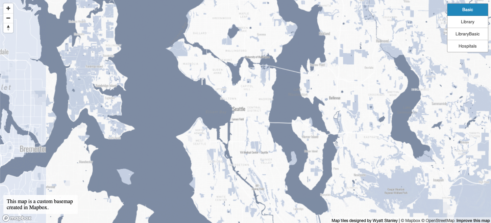

# CustomTiles

<h3>
    Geog 458: Mapbox Tile Generation 
</h3>

URL Access: https://WyattStanley.github.io/CustomTiles/index.html

<h3>
    Custom Basemap:
</h3>

For this map I chose to cusomize the monochrome map that is provided by mapbox. I cusomized it by changing the color of the water to a dark blue and the land to a light blue. I also changed the color and fonts of the titles. 

<h3>
    Library Data:
</h3>

For this map I used the monochrome light mapbox map and added library location data in Seattle. I changed the color of the data points to orange because it complemented the blue custom map I made. 

<h3>
    Library Data with Basemap:
</h3>

For this map I overlayed the orange library points over my custom blue map. 

<h3>
    Hospital Data:
</h3>

For this map I wanted to display hospital data becasue that is the theme of my final project for this class. I decided to represent the land and water through a light blue shade and the hospital data through green. I thought that green was a good color for hospitals because it represents life and growth. Along with this I thought that the light blue went well with the green.

<h3>
    Examined Geographic Area:
</h3>

For these maps I focused on the Seattle area for both my customization and my data. For these maps I found my data at <a href="https://data-seattlecitygis.opendata.arcgis.com">Seattle City GIS Open Data</a>.

<h3>
    Available Zoom Level:
</h3>

The zoom levels for this project cover the Pacific North West along with a section of Canada. This zoom level covers more than enough for what is displayed in these maps. 

